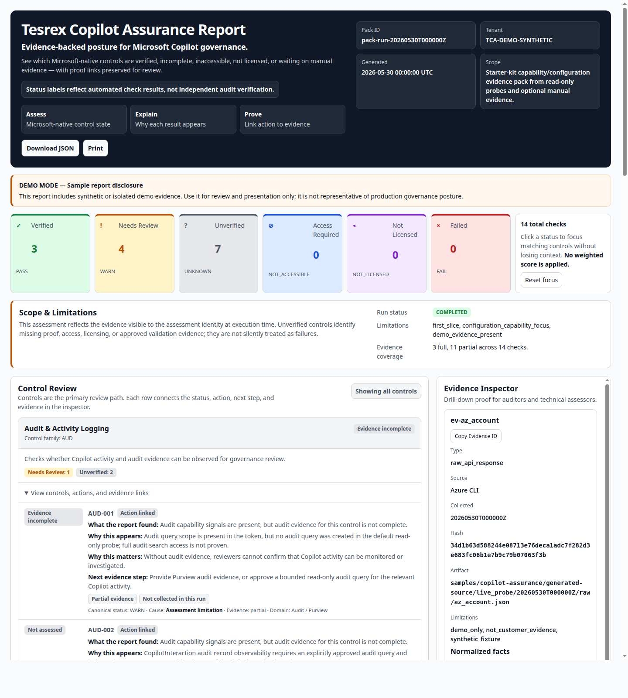

# Tesrex Copilot Assurance Starter Kit

A free, self-hosted governance evidence starter kit that helps Microsoft 365 teams see where Copilot-related Microsoft-native controls are visible, incomplete, inaccessible, or require manual evidence.

It is designed to reduce the friction of checking governance evidence across Microsoft Purview, Graph, SharePoint, Audit, licensing, eDiscovery, and related control surfaces.

## View sample output



Start here if you only want to see what the tool produces:

- [Sample human-readable evidence pack](samples/copilot-assurance/evidence_pack.md)
- [Sample machine-readable evidence pack](samples/copilot-assurance/evidence_pack.json)
- [Sample folder notes](samples/copilot-assurance/README.md)

The committed sample is synthetic-only. It was generated without live Microsoft tenant access and is not customer evidence or audit proof.

## Run it locally

Clone the repository and run the synthetic demo without any Microsoft tenant access:

```bash
git clone https://github.com/robert896r1/tesrex-copilot-assurance.git
cd tesrex-copilot-assurance  # run commands from the repository root
PYTHONPATH=src python3 scripts/create_demo_report.py
```

The command prints the generated Markdown, JSON, and HTML report paths under local ignored `artifacts/`. Those outputs are local-only; do not commit `artifacts/` or use generated local paths as public website links.

If you have `just` installed, the convenience path is:

```bash
just check
just demo
just serve
```

Then open the generated report URL under `http://127.0.0.1:8766/`. This is a local-only report created for the machine running the starter kit.

## What this is

Tesrex Copilot Assurance (TCA) is a local governance evidence-pack generator and readiness aid.

It helps you:

- inspect a sample Copilot governance evidence pack;
- understand how control visibility, permission gaps, licensing gaps, and manual evidence needs are represented;
- run a tenant-free synthetic demo locally;
- use the code as a starting point for your own Microsoft 365 Copilot governance checks;
- contribute documentation, UI, tests, and Microsoft ecosystem change reports.

## Why this is useful

Microsoft 365 Copilot governance evidence is spread across several Microsoft surfaces. This starter kit provides a single local report pattern that separates:

- what was verified;
- what could not be read;
- what needs licensing or permissions;
- what needs manual evidence;
- what is only demo/sample material.

The value is not that it replaces Microsoft controls. The value is that it gives operators, technical directors, and reviewers a clearer way to package Microsoft-native control evidence into one explainable view.

**Important:** TCA complements Microsoft-native governance controls. It does not replace Microsoft Purview, SharePoint Advanced Management, Entra, Audit, eDiscovery, Copilot Control System, or your tenant governance process.

## What this is not

This starter kit is **not**:

- a managed Tesrex service;
- an audit certification;
- legal or compliance advice;
- a compliance guarantee;
- a Copilot replacement;
- a Copilot enforcement layer;
- a Teams chatbot;
- a runtime interceptor of Copilot answers;
- a replacement for Microsoft Purview, SharePoint Advanced Management, Entra, Audit, eDiscovery, Copilot Control System, or Microsoft 365 admin controls.


## Prerequisites

Demo mode uses the Python standard library only. For the smoothest path:

- Python 3.12+
- Git
- `just` task runner, optional convenience
- `jq`, only required for the optional `just check` convenience target
- Azure CLI, only required for tenant-connected mode

The primary demo command uses Python directly. `just` is only a convenience wrapper.

## Quick start: synthetic demo mode

Demo mode does **not** connect to Microsoft 365 and does **not** read tenant data. It creates synthetic/example evidence so you can inspect the report format safely.

Using `just`:

```bash
just check
just demo
```

Without `just`:

```bash
PYTHONPATH=src python3 -m compileall -q src tests
PYTHONPATH=src python3 -m unittest discover -s tests -p 'test_*.py'
PYTHONPATH=src scripts/create_demo_report.py
```

The demo command prints the generated paths, including:

- `EVIDENCE_PACK_JSON`
- `EVIDENCE_PACK_MD`
- `EVIDENCE_PACK_UI`

Serve the local artifacts directory:

Using `just`:

```bash
just serve
```

Without `just`:

```bash
PYTHONPATH=src scripts/serve_artifacts.py --port 8766 --directory artifacts
```

The serve command prints the active base URL and report URL pattern. It binds to `127.0.0.1` and serves the ignored local `artifacts/` directory only. Do not expose generated evidence reports on a public or shared network without your own authentication and data-handling controls.

Then open the report path under the printed `BASE_URL`, removing the leading `artifacts/` segment from `EVIDENCE_PACK_UI`.

Example shape:

```text
http://127.0.0.1:8766/evidence_packs/run-<timestamp>/evidence_pack_ui.html
```

Demo outputs are marked synthetic/example. Do not use demo reports as customer evidence or audit proof.

## Safety model

The public demo path is synthetic-only and does not modify a Microsoft tenant.

Tenant-connected scripts are separate and default to read-only collection. The starter kit does not support tenant mutation, auto-remediation, write actions, exports, purges, or holds in the public quick start.

If you add new collectors, keep default behavior read-only and update tests/docs before relying on the result.

## Tenant-connected mode

Tenant-connected mode is separate from demo mode.

The current read-only assessment path fails closed unless you assert the tenant that the Azure CLI session is expected to use. Authenticate to the intended tenant, export its tenant ID, and run one of the two paths below:

```bash
az login --tenant '<expected-tenant-id>'
export AZURE_TENANT_ID='<expected-tenant-id>'

# Collect the allowlisted read-only probe evidence only.
PYTHONPATH=src python3 scripts/live_readonly_probe.py

# Or collect and build the Markdown/JSON evidence pack.
PYTHONPATH=src python3 scripts/run_assessment.py
```

You may pass `--expected-tenant-id` instead of exporting `AZURE_TENANT_ID`. Before acquiring a Graph token or calling Graph, the command runs `az account show`, requires an exact tenant-ID match, and prints a `TCA_TENANT_PREFLIGHT=VERIFIED` boundary. Missing or mismatched tenant assertions stop the run. `--help` never inspects Azure state.

Tenant-connected mode depends on your Microsoft tenant, app registration, Graph permissions, Purview/RBAC setup, licensing, and approved evidence boundaries.

Default posture:

- read-only first;
- no auto-remediation;
- no broad content scan;
- no default tenant mutation;
- no public CLI mode for bounded validation or mutation.

See:

- `docs/least_privilege_matrix.md`
- `docs/manual_evidence_protocol.md`
- `docs/limitations.md`

## Reading the report

The report separates formal status from why that status appears.

Common outcomes:

- `PASS`: evidence was sufficient for this starter-kit control check.
- `WARN`: attention is needed, but this is not automatically a tenant failure.
- `FAIL`: the collected evidence indicates a control gap.
- `UNKNOWN`: the run did not collect enough evidence to classify the control.
- `NOT_ACCESSIBLE`: the assessment identity could not read the needed source.
- `NOT_LICENSED`: available evidence indicates the relevant capability/license is not present.

Every non-clean control should explain:

- what the report found;
- why this appears;
- why it matters;
- the next evidence step.

## Evidence sensitivity

Generated evidence packs and raw artifacts can contain tenant metadata, policy names, site names, identities, license state, and audit/eDiscovery context.

Do not commit real assessment artifacts to a public repository. Review and sanitize anything before sharing externally.

## Public release status

This repository is the public starter-kit distribution of Tesrex Copilot Assurance.

Current public-readiness state:

- sample output is committed under `samples/copilot-assurance/`;
- a stable report screenshot is committed under `docs/assets/`;
- GitHub issue templates are included for bug reports, mapping discrepancies, Microsoft changes, and documentation improvements;
- repository guards and tests are available through `just check` or the raw Python commands below.

License: MIT. See `LICENSE`.

## Contributing

See `CONTRIBUTING.md`.

Good contribution areas include:

- documentation fixes;
- UI/report readability improvements;
- tests and fixtures;
- Microsoft API/UI/control change reports with source links;
- setup and troubleshooting improvements.

Out of scope by default:

- auto-remediation;
- tenant mutation in default paths;
- generic chatbot/LLM answering;
- Copilot runtime interception;
- hidden telemetry;
- unsupported compliance claims.

## Validation

Run:

```bash
just check
```

The check includes:

- repository boundary guard;
- committed evidence-artifact guard;
- read-only Microsoft tenant contract guard;
- JSON config validation;
- Python compile checks;
- unit tests;
- whitespace checks.

To deterministically regenerate and verify the committed synthetic sample:

```bash
just sample
```

## Key documents

Public user/contributor starting points:

- `docs/README.md`
- `docs/code_walkthrough.md`
- `docs/evidence_contract.md`
- `docs/limitations.md`
- `docs/microsoft_source_review.md`
- `docs/release_readiness_plan.md`
- `SECURITY.md`
- `CONTRIBUTING.md`
- `samples/copilot-assurance/README.md`
